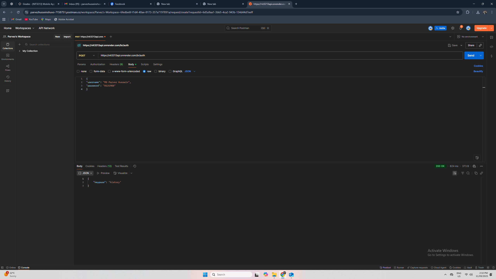
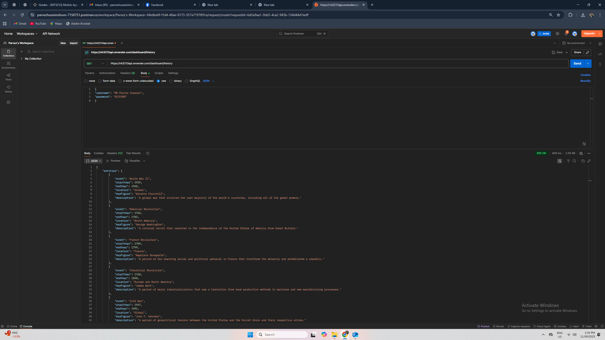
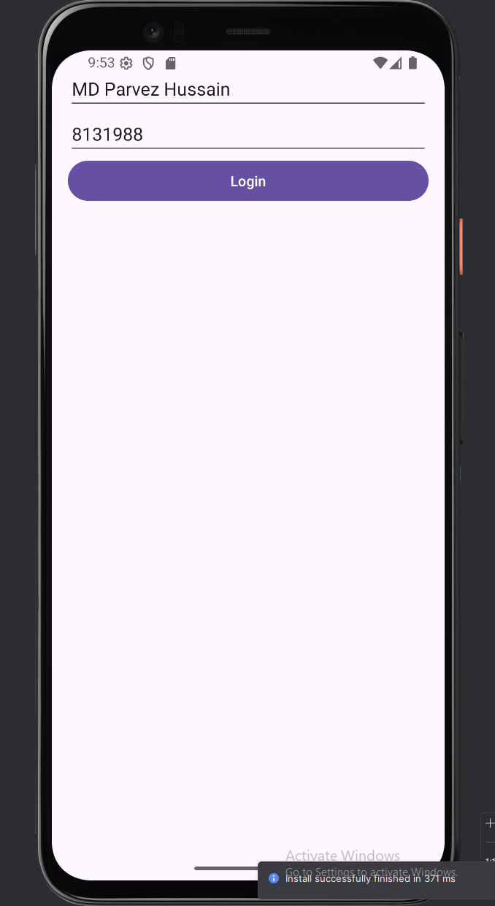
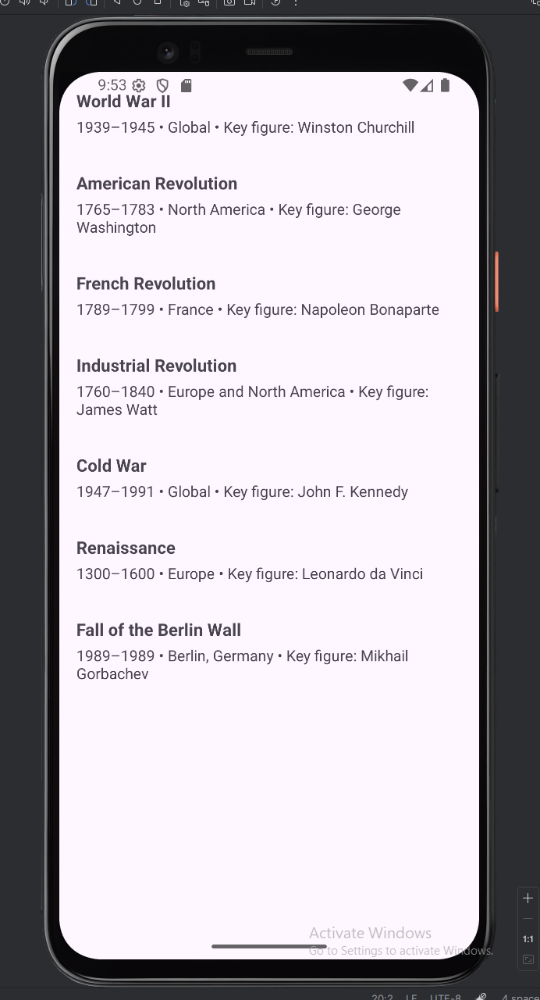
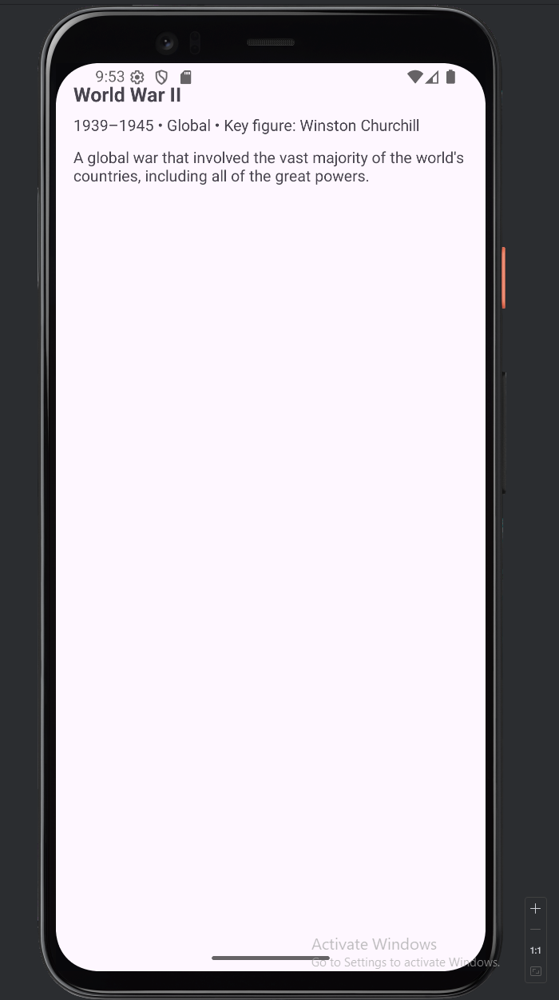

# NIT3213 Final – History
**Student:** MD Parvez Hussain (S8131988)

## Overview
Android app that:
1) Logs in using first name + student ID to retrieve a `keypass`.
2) Loads a dashboard list for topic **History**.
3) Opens a details screen with the full description.

Tech: Kotlin, ViewBinding, RecyclerView, Hilt (DI), Retrofit/OkHttp, Coroutines, JUnit tests.

## API
git clone [https://github.com/parvezhusseinshuvo-ui/nit3213-history.git]
- **POST** `/br/auth`
  - Body: `{"username":"MD Parvez Hussain","password":"8131988"}`
  - Sample success: `{"keypass":"history"}`
- **GET** `/dashboard/history`
  - Returns 7 history entities.

## How to Run
- Android Studio (AGP 8.x), **JDK 17**.
- Open the project, select an emulator (API 34+), and Run the `app`.
- Launcher screen: **Login**.

## App Flow
- **Login** → calls `/br/auth` (campus `br`) → receives `keypass`.
- **Dashboard** → calls `/dashboard/{keypass}` → shows list of items.
- **Details** → shows event, years, location, key figure, and description.

## Tests
- `LoginViewModelTest` – verifies login emits `Success("history")`.
- `DashboardViewModelTest` – verifies list size and item names.

Run: Gradle → `:app:testDebugUnitTest` or right-click the test classes and Run.

## Screenshots

## Notes
- Internet permission enabled.
- Hilt entry point: `NIT3213App` (`@HiltAndroidApp`).
- Base URL in `NetworkModule.kt`: `https://nit3213api.onrender.com/`.

## Credits
-API provided by NIT3213 Assessment.
-Developed by Parvez (S8131988) for submission.
